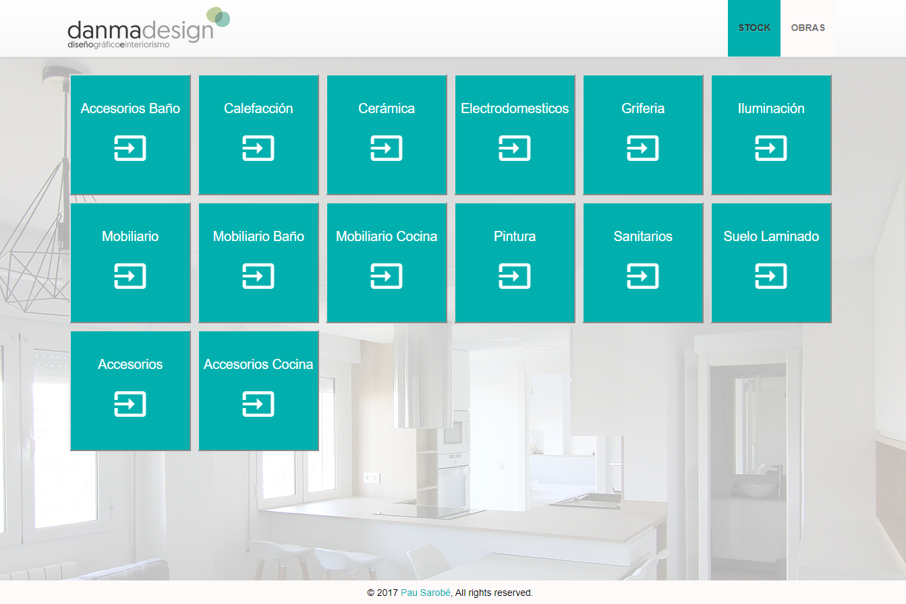
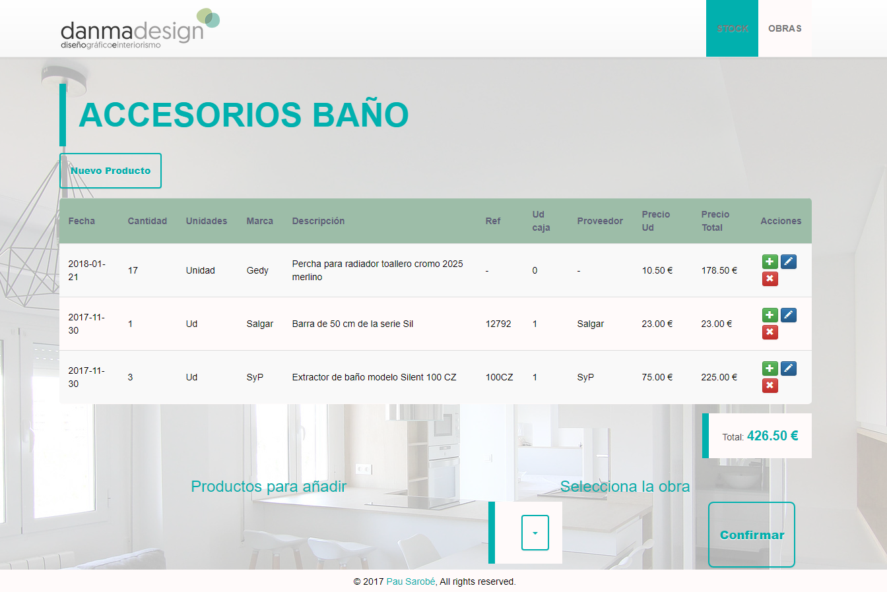
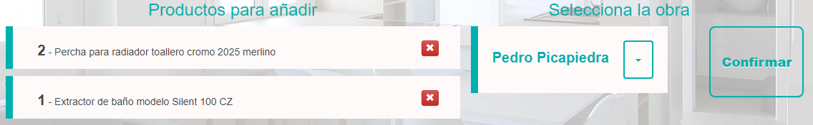
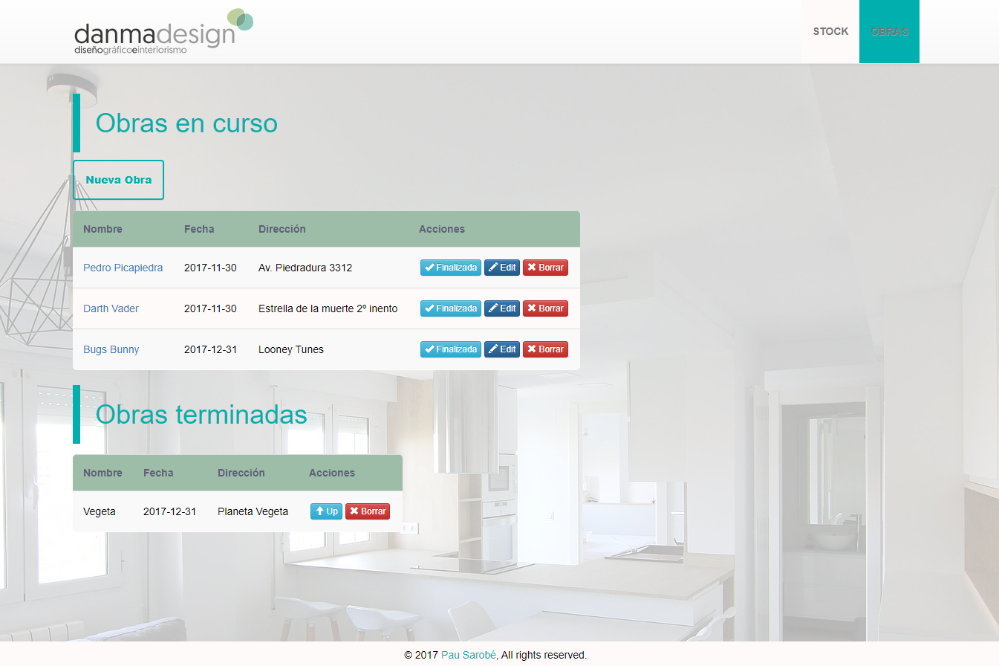
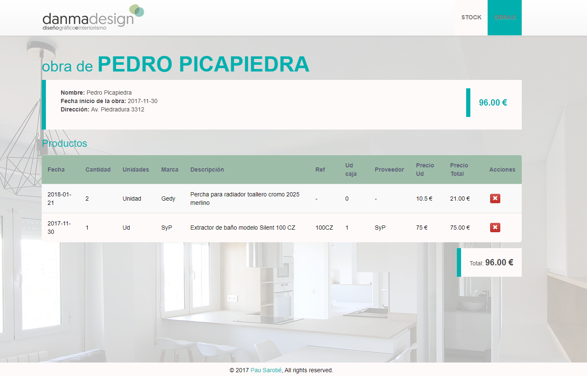

# STOCKER

Stocker es un trabajo Full-Stack presentado como proyecto final del bootcamp de [SkyLabCoders Academy](http://www.skylabcoders.com/es/).

### Instalación

* Necesitas tener instalado el `NodeJS` con `npm`.
* Haz un clon de este proyecto: 
    `git clone https://github.com/pausarobe/stocker.git`

### Run

`$ npm start`

Todas las dependencias quedaran instaladas automáticamente.

### Motivación

Es un proyecto realizado a medida para la empresa de diseño de interiores [Danma](https://www.danma.es/). Trata de la gestión del stock de su almacén relacionado con las obras que tienen en curso.

### Construido con

* Front-end
    - React: 13.1.0
        + React-dom: 16.1.0
        + React-router-dom: 4.2.2
        + React-scripts: 1.0.17
    - Bootstrap: 3.3.5
    - jQuery: 1.12.4

* Back-end
    - Dotenv: 4.0.0
    - Body-parser: 1.18.2
    - Express: 4.16.2
    - Cors: 2.8.4
    - Axios: 0.17.1
    - MongoDB: 2.2.33
    - Mongoose: 4.13.2

### Funcionamiento

Para empezar nos aparecerá la pantalla de **Stock** la cual nos muestra todas las categorías de nuestro almacén.

Entrando en una de ellas, nos aparecerán los **productos** específicos.

En este apartado podemos crear un **Nuevo producto**, a su vez a los ya creados podremos **editarlos**, **eliminarlos** y **añadirlos** a la obra que queramos. Ejemplo:

Al darle al botón de _Confirmar_ los productos elegidos se restaran de nuestro almacén e irán a la obra seleccionada.

En la sección **obras** las encontraremos diferenciadas por _en curso_ y _terminadas_ que podemos ir cambiándolas con los botones **finalizada/up**. Como en el apartado Stock también podremos **Crear**, **editar** y **eliminar** una obra. 

Dentro de la obra veremos todos los productos que hemos ido enviando con anterioridad y un total del precio.

